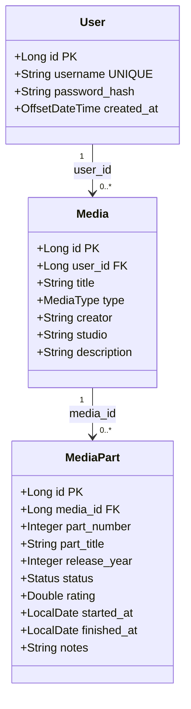

# SightLog – Osobní tracker médií

## 1. Základní informace

**SightLog** je moderní aplikace pro sledování konzumovaných médií (knihy, manga, anime, seriály a filmy) na jednom místě. Umožňuje uživateli udržovat si přehled o stavu rozkoukaných/rozečtených děl, hodnotit je a vést si historii.

Aplikace je postavena na technologiích **Java 25**, **JavaFX 25.0.3** a **Hibernate 7.4.0.Final** s využitím **PostgreSQL** databáze.

---

## 2. Funkce aplikace

- **Správa uživatelů:** Bezpečné přihlášení a registrace s hashováním hesel pomocí jBCrypt.
- **Jednotná knihovna:** Všechna média jsou přehledně zobrazena v hlavní tabulce.
- **Detailní sledování:** Každé médium se může skládat z více částí (série, díly, části), které se sledují samostatně.
- **Automatické agregáty:** Celkový stav média a průměrné hodnocení se počítají automaticky z jeho částí už v DB schématu.
- **Pravidla pro hodnocení:** Hodnotit lze pouze dokončená nebo ukončená díla (stavy `Finished` nebo `Dropped`).
- **Moderní UI:** Tmavý motiv s transparentním hlavním oknem pro příjemný uživatelský zážitek.

---

## 3. Uživatelská příručka

### Správa účtu
- **Registrace:** Při prvním spuštění si vytvořte účet v sekci "Sign In". Zadejte uživatelské jméno a silné heslo.
- **Přihlášení:** Použijte své údaje pro vstup do aplikace. Relace je aktivní po celou dobu běhu programu.

### Hlavní obrazovka
Obrazovka je rozdělena na dvě hlavní části:
1. **Levý panel (Media Overview):** Seznam všech vašich médií s celkovými statistikami (počet částí, průměrné hodnocení, celkový stav).
2. **Pravý panel (Media Parts):** Detailní seznam částí (např. sérií) pro vybrané médium.
3. **Horní lišta:** Ovládací tlačítka pro přidávání, mazání a aktualizaci dat.

### Práce s médii
- **Přidání média:** Klikněte na tlačítko **"Add Media"**. Otevře se dialog, kde vyplníte název, typ (Book, Anime, atd.), tvůrce, studio a popis. Zároveň musíte rovnou přidat první část tohoto média.
- **Smazání média:** Vyberte médium v levé tabulce a klikněte na **"Delete Media"**. Aplikace se zeptá na potvrzení, zda chcete smazat celé médium včetně všech jeho částí nebo konkrétně vybranou část.

### Práce s částmi (Media Parts)
- **Přidání části:** Vyberte existující médium v levé tabulce a klikněte na **"Add Part"**. V dialogu vyplníte detaily konkrétní série.
- **Editace části:** Dvakrát klikněte na řádek v pravé tabulce částí. Otevře se editační dialog, kde můžete změnit stav, hodnocení nebo přidat poznámky.
- **Smazání části:** Vyberte část v pravé tabulce a klikněte na **"Delete Media"**. Aplikace vám nabídne možnost smazat pouze tuto konkrétní část, nebo celé nadřazené médium.

---

## 4. Technické detaily

### Sestavení a spuštění
- **Build:** `./gradlew build`
- **Spuštění:** `./gradlew run`
- **Testy:** `./gradlew test`

### Konfigurace
Aplikace vyžaduje soubor `app.properties` v `src/main/resources/` pro připojení k databázi (JDBC URL, uživatel, heslo).
Byl použit PostgreSQL přes Supabase.

---

## 5. Diagram entitních tříd

### Stavy a typy
- **Status:** `PLANNING`, `IN_PROGRESS`, `FINISHED`, `DROPPED`
- **MediaType:** `BOOK`, `MANGA`, `ANIME`, `TV_SHOW`, `MOVIE`
