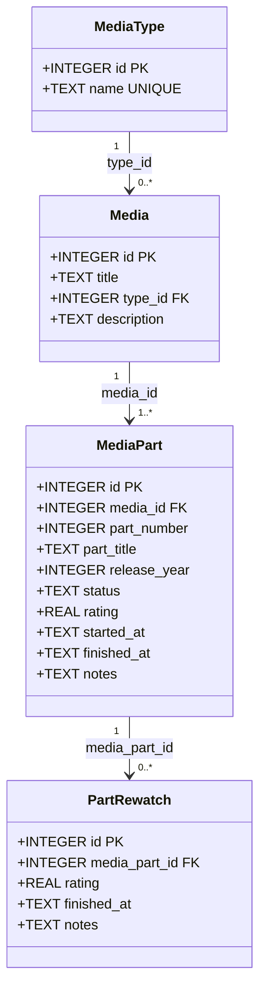

# Sightlog – Návrh aplikace

## 1. Základní návrh aplikace

### Popis

**Sightlog** je osobní aplikace pro sledování konzumovaných médií. Umožňuje uživateli evidovat knihy, mangu, anime, seriály a filmy na jednom místě – včetně stavu sledování, hodnocení a poznámek. Aplikace bude postavena v Javě, JavaFX a Hibernate s lokální SQLite databází.

---

### Funkce aplikace

#### Správa médií
- Přidání média s názvem, typem a popisem.
- Podpora médií s více částmi (sezóny, díly, svazky) – každá část je evidována samostatně.
- Editace a mazání záznamů.

#### Sledování stavu
Každá část média má jeden ze čtyř stavů:

| Stav | Popis |
|---|---|
| `planning` | Plánuji začít |
| `in_progress` | Aktuálně konzumuji |
| `finished` | Dokončeno |
| `dropped` | Opuštěno v průběhu |

Celkový stav média se odvozuje automaticky ze stavů jeho částí.

#### Hodnocení
- Hodnocení v rozsahu **0,0 – 10,0** (desetinná čísla povolena).
- Hodnotit lze pouze části se stavem `finished` nebo `dropped`.
- Hodnocení je zachováno i při opětovném sledování – původní hodnocení se archivuje do historie.
- Celkové hodnocení média je průměr hodnocení jeho částí.

#### Historie opětovného sledování
- Každé restartování dokončeného média vytvoří automaticky záznam v historii (`part_rewatch`) s původním hodnocením a datem dokončení.
- Umožňuje porovnat, jak se vnímání média časem mění.

#### Datové vizualizace
- tahle feature není hlavním cílem projektu, bude implementována pouze pokud na to zbyde čas
- Přehled počtu médií podle stavu a typu.
- Graf aktivity v čase (kdy uživatel co dokončil).
- Rozložení hodnocení (distribuce skóre).
- Statistiky podle žánru/typu média.

---

### Ovládání aplikace

Aplikace se skládá z následujících view/obrazovek:

#### Obrazovka 1 – Přehled médií (hlavní seznam)
Centrální obrazovka aplikace. Zobrazuje všechna evidovaná média jako karty nebo řádky tabulky.
- Filtrování podle typu média a stavu.
- Řazení podle názvu nebo hodnocení.
- Rychlý přístup k editaci stavu a hodnocení přímo ze seznamu.
- Tlačítko pro přidání nového média.

#### Obrazovka 2 – Detail média
Zobrazí se po kliknutí na konkrétní médium.
- Informace o médiu (název, typ, popis).
- Tabulka částí (série/díly) s jejich stavem, hodnocením a daty.
- Možnost přidat novou část nebo upravit existující.
- Historie opětovného sledování pro každou část.

#### Obrazovka 3 – Přidat / Upravit médium
Formulář pro vytvoření nebo editaci záznamu.
- Pole: název, typ, popis.
- Po uložení média přesměrování na jeho detail, kde lze přidávat části.

#### Obrazovka 4 – Statistiky
Přehled datových vizualizací. Grafy a přehledy popsané výše.
- tahle feature není hlavním cílem projektu, bude implementována pouze pokud na to zbyde čas
- Dostupné po přihlášení a evidenci alespoň několika médií.

---

## 2. Diagram entitních tříd

Diagram níže znázorňuje třídy odpovídající tabulkám v databázi, jejich atributy a vazby mezi nimi.

### Popis vazeb

| Vazba | Typ | Popis |
|---|---|---|
| `MediaType` → `Media` | 1 : N | Každé médium má právě jeden typ; jeden typ může mít více médií. |
| `Media` → `MediaPart` | 1 : N | Každé médium má alespoň jednu část; každá část patří právě jednomu médiu. |
| `MediaPart` → `PartRewatch` | 1 : N | Část může mít nula nebo více záznamů o opětovném sledování. |

### Poznámky k atributům

- **`status`** – omezeno na hodnoty `planning`, `watching`, `finished`, `dropped` (kontrolováno CHECK omezením v DB).
- **`rating`** – desetinné číslo v rozsahu 0,0–10,0; může být `NULL`. Nastavit lze pouze tehdy, je-li `status` roven `finished` nebo `dropped` (vynuceno databázovými triggery).
- **`started_at` / `finished_at`** – datum ve formátu `YYYY-MM-DD` (SQLite nemá nativní datový typ DATE).
